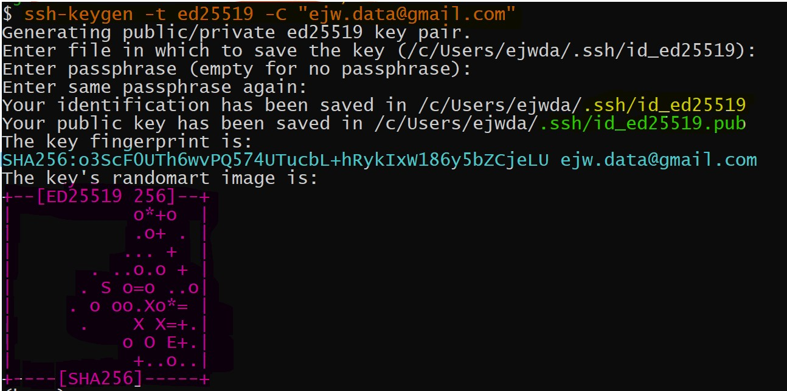

<summary><span id="concept" style="font-size: x-large">SSH Key Concepts</span></summary> 
<hr>
If you would like to learn about the concepts of SSH-keys then expand the section directly below.  You are expected to setup your SSH-keys but there is no other topics related to this in the course.  To setup your SSH keys, continue to the nex section.  
<br>

## Fundamentals

*  To learn how SSH-keys work then read this short [tutorial from Khan Academy](https://www.khanacademy.org/computing/computers-and-internet/xcae6f4a7ff015e7d:online-data-security/xcae6f4a7ff015e7d:data-encryption-techniques/a/public-key-encryption) which provides a nice interactive example.  

## Overview

<br>

* SSH stands for Secure Shell

* SSH-keys are used as part of a security process so encrypted information can be transferred between two sources and decoded to an interpretable form such that there is confidence that the two sources are legitimate and not an unwanted third-party.  

* I typically call the two sources the local and remote machine.  In the case of GitHub, the local machine is your computer and the remote machine is the cloud-based GitHub account.  There are several other names used.  

>SSH-key Filenames

  *  SSH-keys are generated with an algorithm on the local machine.  Two pairs of keys are created during this process.  One key is the private key and for our purposes it will be named something like `id_{security protocol name}` and the public key will look the same but have the suffix of `.pub` added to indicate that it is the public key.  It is important that we only share the public key (aka the contents inside the `id_{security protocol name}.pub` file).  The public key is used for encryption.  The private key is used for decryption.  There is a situation where these roles can be reversed but we still do not give out the private key under any circumstances.   

>SSH-key Terminal Output

  * The public key is just a text file and if you look inside it you will typically see text that indicates the protocol used and the email attached to the SSH key.  Sometimes people think the output of the ssh-key command in terminal/gitbash is the ssh-key but this is actually what is called the fingerprint and randomart image.  Here is an example:
  


  * The orange part of the image is the SSH key generation command using the ed25519 protocol.  There are several different algorithms that can generate the ssh-keys.

  * The inputs to for the image were not customized and I hit enter for each one.  
    * The first request was 'enter file...' and this is asking me where to put the file and what to name it.  It provides the default in parentheses.  
    * The second request was 'Enter passphrase...' and this is adding extra security so if someone gets my private key then they must provide a password to access it.
    * The third request is just the confirmation of the above passphrase.
    * Now the next part is a nice confirmation.  The green and yellow text is the location of the ssh-keys.  These are just text files.
    * I believe everything else is used for manual verification of your authenticity so we will not bother with this.

>SSH-key File Content

  * <span id="key">The actual content inside the above generated public key looks like this:  </span>
    ```ssh-ed25519 AAAAC3NzaC1lZDI1NTE5AAAAIOgqz9ciCwISG9i1Mcwg/TYERR7GGppra9mJrPALWQC9 ejw.data@gmail.com``` 

  * **_Note_**:  This ssh-key is one line of text with two spaces (3 text groups).  It shows up differently based on your display window size but it shows first the protocol then a string of text with a slash and then the email address.  This code does not match the fingerprint shown in the image.

<br>
<br>