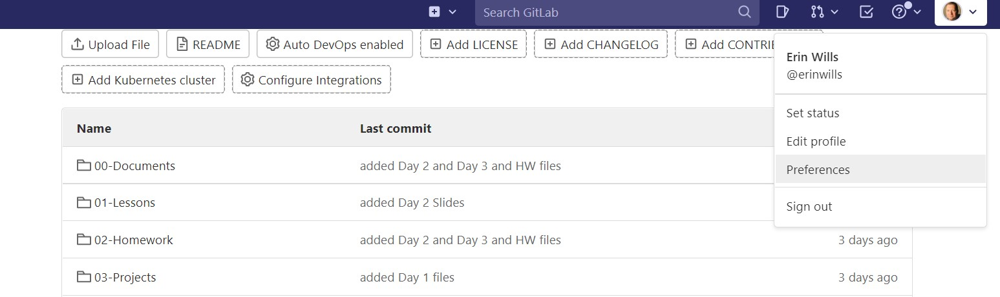
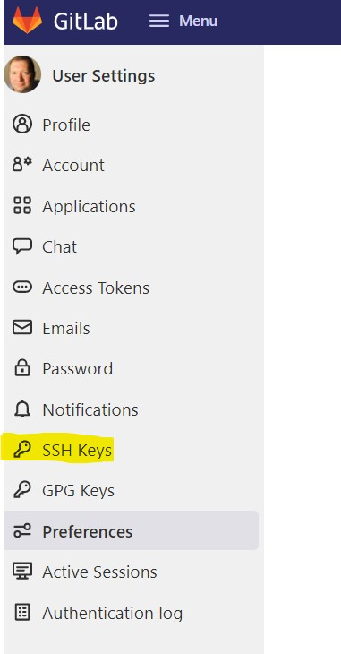
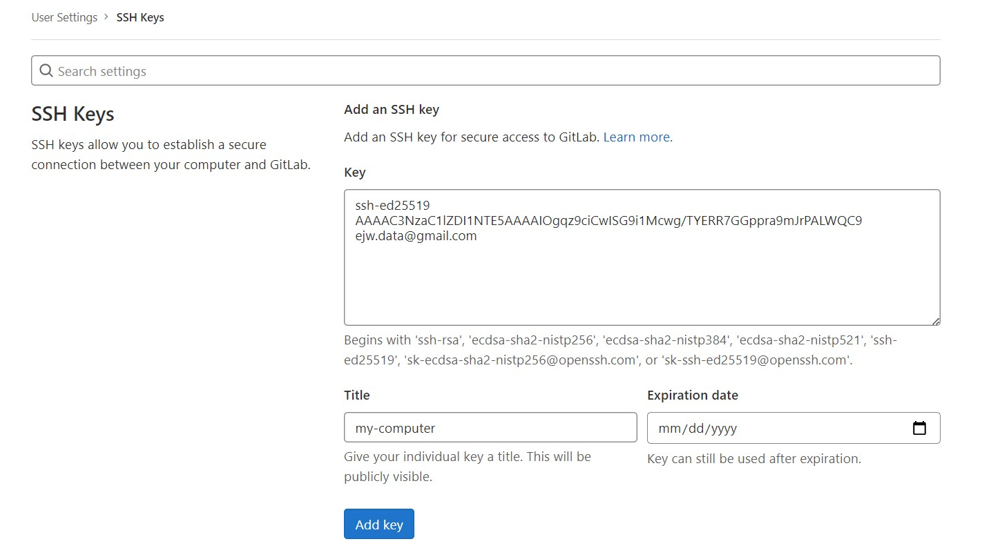
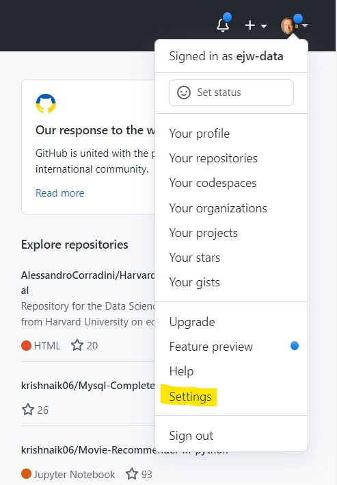
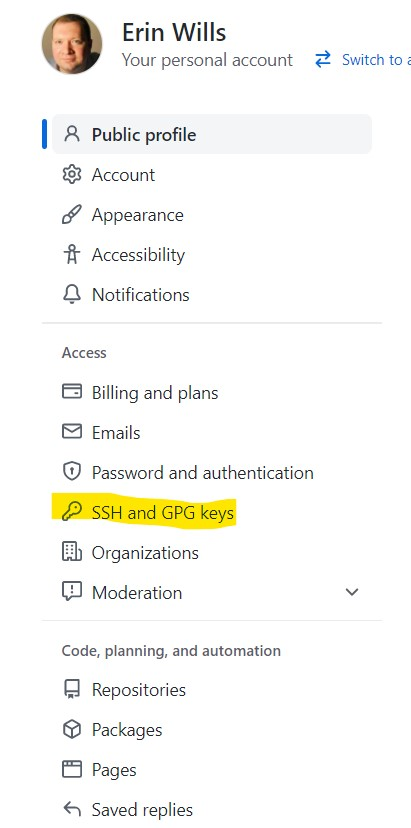
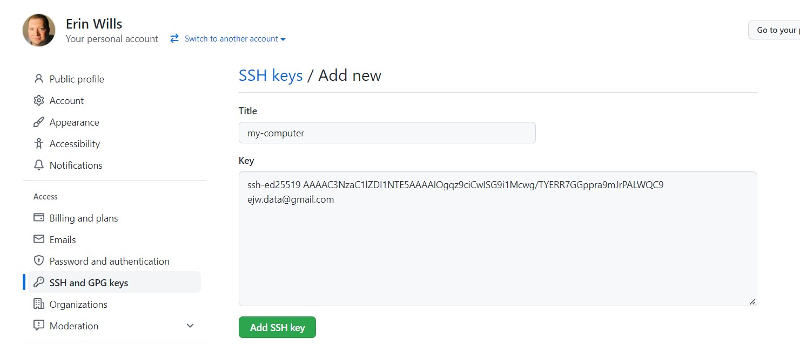

If you would like to learn about the concepts of SSH-keys then visit this [additional page](./git-explanation.md).  You are expected to setup your SSH-keys but there is no other topics related to this in the course.  To setup your SSH keys, continue to the next section.  

 

# Setting up SSH Keys:

1.  Check that Git is installed from terminal (mac) or GitBash (PC):  
    * Type `git --version` and you should get a response.  If the response is something like `command not found` then install Git based on the Prework Instructions.
1.  Setup Git configuration from terminal (mac) or GitBash (PC)
    1.  Check that your name has been added to Git - PC/mac:  `git config --global user.name` 
    1.  To set the name - PC/mac:  `git config --global user.name "Your Name"`
    1. Check that your email has been added to Git - PC/mac:  `git config --global user.email`
    1. To set the email (same as gihub/gitlab) - PC/mac:  `git config --global user.email “youremail@whatever.com”`
1.  Check to see if you have existing ssh-keys from terminal/GitBash:
    *  Type `ls -al ~/.ssh`.  
    *  The above command says "list all files in the root .ssh folder".
    *  If you see a list of key files that have a format like "id_xxxxx" and "id_xxxxx.pub" then you can skip to the [Copy Public Key](#copy) section.  Even if you have keys you can overwrite them by following the next few steps. 

1.  Generating a new SSH-key for PC/mac with ED25519.  Do these steps in GitBash/terminal:
    1.  Type `ssh-keygen -t ed25519 -C "your_email@example.com"`
        *  When asked to "Enter a file...":  press Enter
        *  When asked to "Enter passphrase ...":  press Enter
        *  When asked to "Enter same passphrase again":  press Enter
    1.  Now you will see text like in the image in the [SSH Key Explanation Document](./ssh-key-explanation.md#concept) section. 
1.  Store keys.  Do these steps in GitBash/terminal:
    1.  Next start the ssh-agent:  
        * `eval "$(ssh-agent -s)"`
        * Should see a message like "Agent pid xxxx"
    1.  Next add the private key to the agent:
        * `ssh-add ~/.ssh/id_ed25519`      
1.  Copy contents of public key. Do these steps in GitBash/terminal:
      * PC: `clip < ~/.ssh/id_ed25519.pub`
      * mac:  `pbcopy < ~/.ssh/id_ed25519.pub`

  *  **Note**:  If you receive a message that you cannot use ED25519 protocol then use the one recommended in the error message.  GitLab supports these SSH key types:  RSA, ED25519, ED25519_SK, and ECDSA_SK.  I believe there are more problems using RSA and ECDSA.  First try to use ED25519 and if that does not work then come see a TA during office hours or post a question to the Slack channel `#ask-the-class`.   

  * If this works, you should be able to paste the key from the clipboard to a simple text editor like Notepad (not Word; use an editor that doesn't allow text formatting).  The key should look like the example from the [SSH Key Explanation Document](./ssh-key-explanation.md#concept) section.  This text needs to be added to both GitHub and GitLab.  Go to those steps below.  

   

## Pasting Public Key into GitLab
1.  Login to GitLab:  https://git.bootcampcontent.com/ 
1.  Go the the profile icon in the upper right corner and select "Preferences"
  
1.  Select "SSH Keys" from the left menu

1.  Paste the Public Key into the large input box
    * PC:  CTRL + V
    * mac:  CMD + V
    * Right Click
1.  The title can be anything and the expiration date can be left blank.
1.  Select "Add Key"
  

 

>### You must also do this process for GitHub
## Pasting Public Key into GitHub

1.  Login to GitHub Account. 
1.  Go the the profile icon in the upper right corner and select "Settings"
  
1.  Select "SSH Keys" from the left menu

1.  Paste the Public Key into the large input box
    * PC:  CTRL + V
    * mac:  CMD + V
    * Right Click
1.  The title can be anything and the expiration date can be left blank.

>**The Same Public Key can be used for both websites**

 
 
If there are errors then we may need to do some updates or other changes.  The documents below cover some of the most common issues.  The GitHub documents are probably the best resources.  

 
 

## Testing Connections in Terminal/GitBash
1.  All the commands should be done in GitBash (PC) or Terminal (mac)
1.  Check SSH Key for GitLab
    *  Type: `ssh -T git@git.bootcampcontent.com` and then hit enter. 
    *  (Please note that there's one space between `ssh` and the hyphen, no spaces between the hyphen and the `T`, and the remaining `'git@....`. 
    *  You might see a message saying that the authenticity of the host can't be established. This is nothing to worry about. When prompted with "Are you sure you want to continue connecting (yes/no/[fingerprint])?" Please type "yes" and then hit enter. If this succeeds, you'll see "Welcome to GitLab, @'your username'! 
1.  Check SSH Key for GitHub 
    *  Type: `ssh -T git@github.com` and then hit enter. 
    *  If this succeeds, you will see "Hi 'yourusername'! You've successfully authenticated, but GitHub does not provide shell access."
1.  That is everything.  If you get those messages then you should be ready to go.  If you don't get those messages then most likely you did not do all the steps and need to go back to the beginning and try again.  

 
 

## References:

* [Check if Public Keys Already Exist](https://docs.github.com/en/authentication/connecting-to-github-with-ssh/checking-for-existing-ssh-keys)
* [Generating SSH Keys and Adding Public Key to GitHub](https://docs.github.com/en/authentication/connecting-to-github-with-ssh/generating-a-new-ssh-key-and-adding-it-to-the-ssh-agent)
* [Copy Public Key to Clipboard](https://docs.github.com/en/authentication/connecting-to-github-with-ssh/adding-a-new-ssh-key-to-your-github-account)

* [GitLab Documentation](https://docs.gitlab.com/ee/ssh/)

