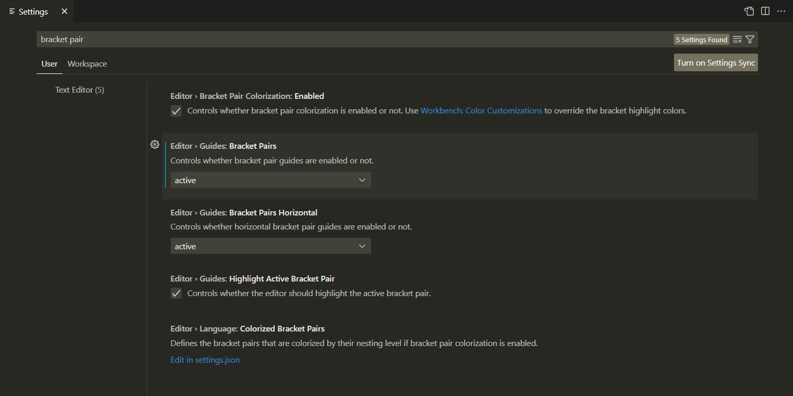
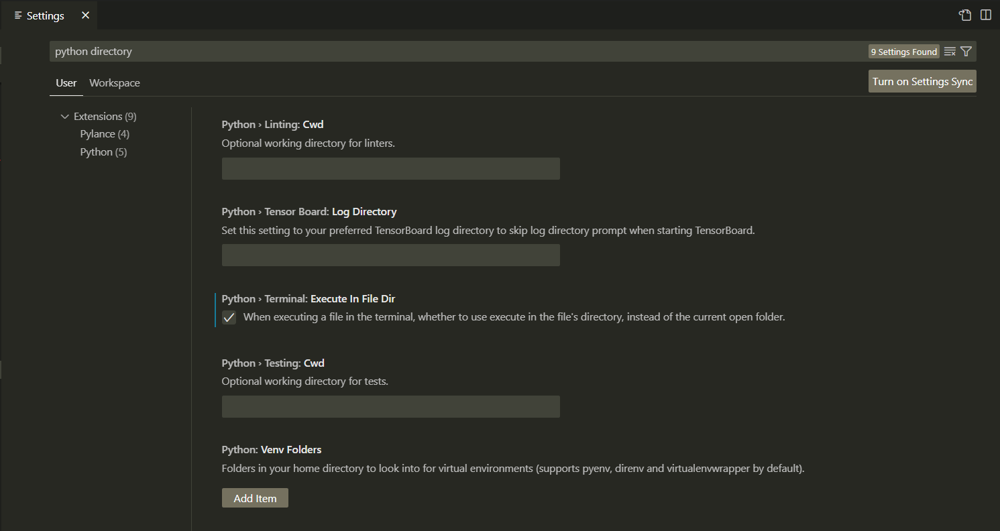
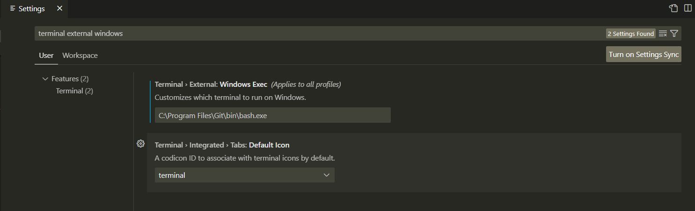
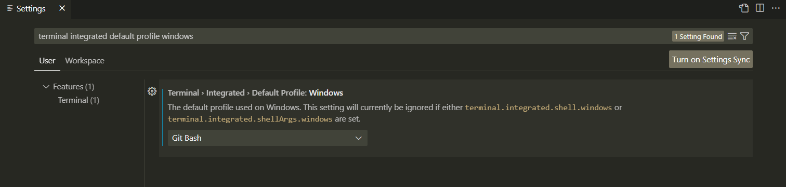
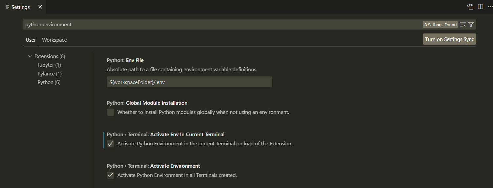

## VSCode Tips...

VSCode is a simple IDE (integrated development environment) where we can write code.  You have already seen one IDE when we worked with the VBA Editor in Excel.  VSCode is very versatile and has a very nice interface but it is not the only IDE available to write code.  We will only support VSCode and only limited functionality becasue setting it up for every OS version would take too long but the core functionality will be available without any customization.  

Here are some common things we will use VSCode for:
*  View Code - In VSCode, go to the `File` menu and select `Open Folder`.  Open the `NU-VIRT-....-LOL` folder - click the folder name and then click the Select Folder button.  You should see in the left sidebar the file structure.  You can navigate to any student activity (marked with a folder named as `##-Stu_Activity_name`) and click on the .md file.  You will now see the contents of that file in markdown language.  To see the formatted text file then click the icon in the upper right corner of VSCode that looks like a book with a magnifying glass.  When this is selected it will let you preview the file in a nicer looking form.  It will be in a new tab.  You can move this tab or close the original .md tab so you can see more of the document.  You can also open any .vbs, .py, or any other simple text file.  
* Most of the time when you open a folder to get the folder pane view on the left side, you will be able to go to `File` > `Open Recent` to quickly navigate to folders and files.  
* There are vscode extensions (left sidebar icon that shows four boxes) that let you view PDF, csv, excel, jupyter and other file formats.  
* To view the internal terminal, go to `View > Terminal`.  This feature is not always setup correctly so it might not replace terminal or gitbash.  Below are some settings to get VSCode features to work on Windows machines.  
* Often coders will find a particular theme color scheme that they like for syntax highlighting.  My favorite theme is a VSCode default theme called `Monokai`.  This theme has a dull dark grey background color and bright, high contrast text.  There are also custom themes that can be downloaded.  An alternate theme that many people compliment is called `Github Dark Default` and is an extension that can be added to VSCode.  This theme uses a very dark black background and high contrast fonts.  To select your theme go to `File` > `Preferences` > `Theme` > `Color Theme`.  A list will pop up that you can select the specific theme you would like to test.  

### Configuring VSCode for Windows  

Below are instructions to configure common features that will be helpful when using VSCode.  I don't remember if Mac users need to make changes to the VSCode Settings since you are using your systems defaul terminal but Windows users typically need to make the below changes.  

To access the VSCode Settings, you can go to `File` > `Preferences` > `Settings` or you can use `CTRL`+`,` for Windows users or `CMD`+`,` for Mac users.    

Since there are many settings, we often need to use the `Search Settings` box at the top of the VSCode Settings page.  The instructions below indcate what to search for and what to do with the results.  

`CTRL` + `,` then search for `bracket pair` - turn on block highlighting
  - `Editor › Bracket Pair Colorization: Enabled: (checked)`
  - `Editor › Guides: Bracket Pairs: active`
  - `Editor › Guides: Bracket Pairs Horizontal: active`
  - `Editor › Guides: Highlight Active Bracket Pair: (checked)`

`CTRL` + `,` then search for `python directory` - execute from file's directory
 - `Python > Terminal:Execute in File Dir`.

`CTRL` + `,` then search for `terminal external` (Windows only)
  - `Terminal › External: Windows Exec:  C:\Program Files\Git\bin\bash.exe` -  sets git bash as default terminal 
  - `Terminal: Explorer Kind: external` - by right clicking of file in vscode explorer  
  - `Terminal > Integrated > Default Profile: Windows: Git Bash`

`CTRL` + `,` then search for `terminal integrated default profile windows`
  - `Terminal › Integrated › Default Profile: Windows: Git Bash` - sets bottom of screen terminal to be Git Bash

`CTRL` + `,` then search for `python environment` - sets terminal environment to match active interpreter
  - `Python › Terminal: Activate Env In Current Terminal: (checked)`
  - `Python › Terminal: Activate Environment: (checked)`
  

After the above settings have been made then I think you will have access to:
 *  an option when you right click on a file in the VSCode left side bar to `Open in External Terminal` and `Reveal in File Explorer`.  I think Mac users will have `Open Terminal in Folder`   

*  In the future we might run some python files (.py extension).  When we do that then we will test to see if the `Run` button (shaped like a play button in the top right) executes the code in the terminal correctly.  With the above changes for windows users then it should execute.  If the code does not execute then you can use terminal/gitbash to execute it, which is the typical method that we use.  Setting up the VSCode terminal is just a bonus if we can get it to work. Other ways that we can execute code is by navigating to the correct folder in the VSCode terminal and running `python filename.py`.  

       

