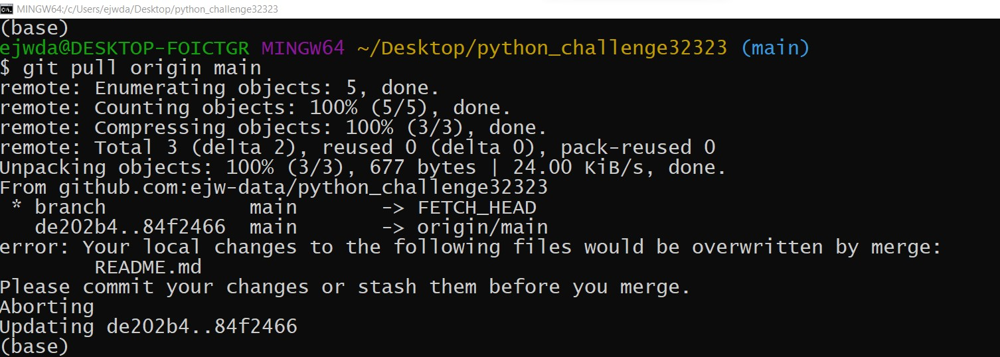
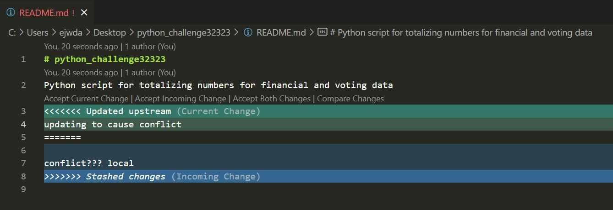
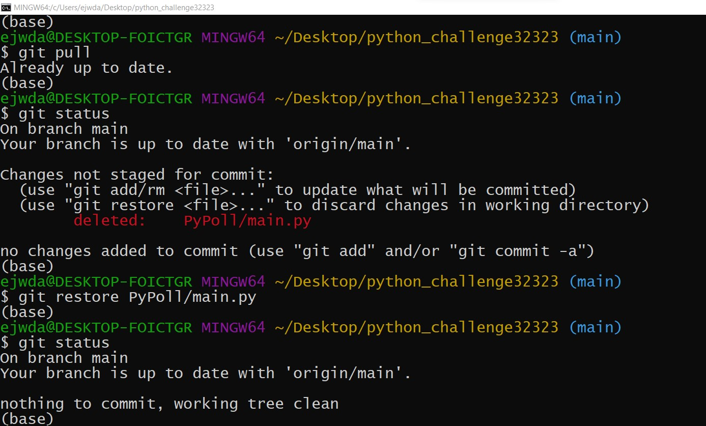
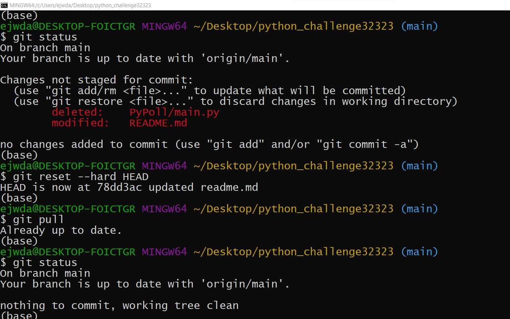
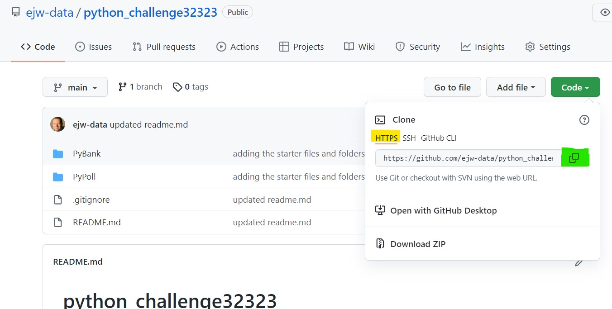
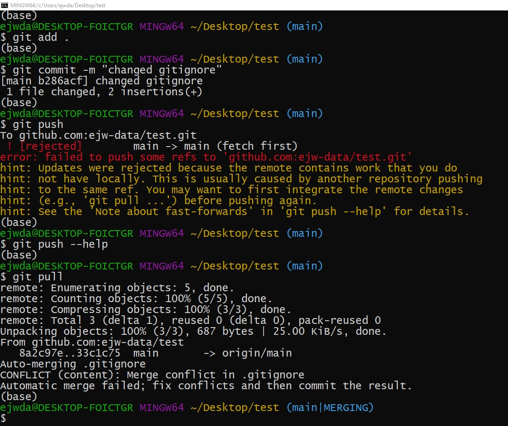
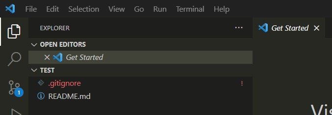
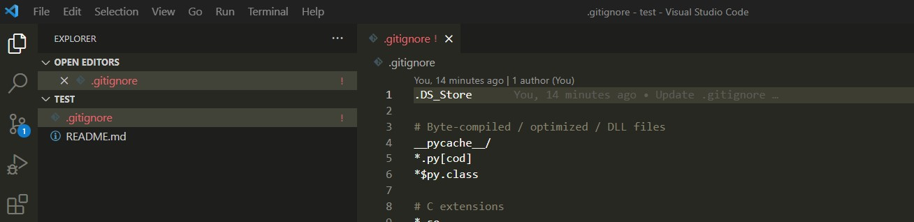
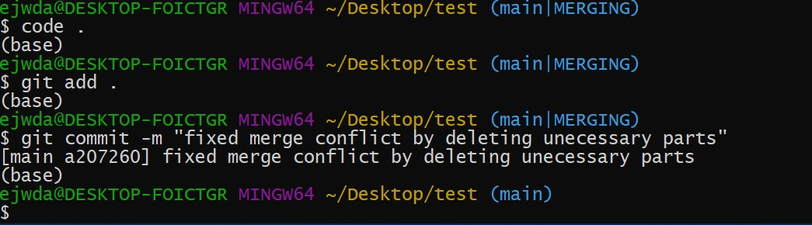

# Welcome to Data Analytics & Visualization!  
Below you will find some helpful resources.  I will keep updating this page and adding content that is most relevant for that time period.  Most of the content below will be linked to markdown files in the `00-Documents` folder.  Since I will be adding content, frequently come to this page.  I will try to remember to add ```(New)``` infront of recently added content to focus your attention to it.  

<br>

# Goals for Current Week
- ```(New)``` See past goals [LINK](./00-Documents/past-goals.md)  

**Goals for Week 3**   
 - [ ] If you have not submitted HW 1 then come to office hours and sign up for a Tutor.  
 - [ ] Make sure to read the the VBA HW Slack advice [LINK](https://nuvirtdatapt0-isb1330.slack.com/archives/C05G2UQEJBF/p1694536429419559).  This post has a link to a previous post and information about a supplemental material added to the repo (located [HERE](./00-Documents/Curriculum-Support/02-VBA/))
 - [ ] You need start doing `git pull origin main` from the terminal on the `NU-VIRT....LOL` folder.  See instructions below about the details about how to do this.  
 - [ ] The expectation is that you have `git`, `ssh-keys`, and `python` working on your computer.  If you don't have these working, then come to office hours immediately.  
 - [ ] Also, lets test to make sure you can go to terminal and are able to do the following:  `conda activate dev` or `source activate dev`.  The video for getting the `dev` python environment setup is found [HERE](https://nuvirtdatapt0-isb1330.slack.com/archives/C05G2UQEJBF/p1694484530902429).  Report any errors you get so we can help resolve the issue.  
 - [ ] Try to work on VBA HW so you can bring questions to Thursday's Office Hours.  The goal should be to finish VBA over the weekend and review python content from Day 1 and Day 2.  

  <br>

# Videos:

*  [Install Python (Anaconda)](https://zoom.us/rec/share/l0STfFiJ-ASp9xhSMb9-9dxassUrwpZTcpxXdUmTPpo4Lg3LusbWgF0PV1jUeu8.RCTyvYT27TBqc2GF?startTime=1694477967000)
*  [Create Python Environment](https://zoom.us/rec/share/l0STfFiJ-ASp9xhSMb9-9dxassUrwpZTcpxXdUmTPpo4Lg3LusbWgF0PV1jUeu8.RCTyvYT27TBqc2GF?startTime=1694478710000)  
*  [Theo's Gitlab Cloning (Starts at 7:00)](https://zoom.us/rec/play/ZWT9F3IKkJm4mCoM3kVZVs9wZWPTOkY0_ZgqT6W5w8VdjZ3bQH3eIsNemHcLcASvYMTzbit_Dpl9-L7B.BbNNoJ03G01T_xWF)
*  [Pulling the Repo (Starts at 0:00)](https://zoom.us/rec/play/J5bzyg67tuynRLJnyJg07gn8swQBKE0xGTr6DIjbCU03eZfiJQ2F9P3_xjVPJqC-1Njpcm1gLr3QweVS.3KXhtwU933vJ3TZH)
*  [Setting Up SSH Keys (Partial Demo/Starts at end of video)](https://zoom.us/rec/play/J5bzyg67tuynRLJnyJg07gn8swQBKE0xGTr6DIjbCU03eZfiJQ2F9P3_xjVPJqC-1Njpcm1gLr3QweVS.3KXhtwU933vJ3TZH)


# 00-Documents  

Important Information:  
  * [SSH Key Setup](./00-Documents/ssh-keys-setup.md)  
  * [Two-Factor Authentication](./00-Documents/gitlab-github-two-factor-auth.md)
  * [Explanation of the 4 Gits](./00-Documents/git-explanation.md)  
  * [Original README Resource page](./00-Documents/gitlab-key-topics.md)  
  * [Writing Nice README.md Files](./00-Documents/readme-guide.md)  
  * [Slack Etiquette](./00-Documents/slack-etiquette.md)  
  * [Git Tasks](./00-Documents/git-starter.md)   
  * [Added VBA Day3 Activity 6 Expanded](./00-Documents/Curriculum-Support/02-VBA/)
  * ```(New)``` [Common Terminal Commands](./00-Documents/common_terminal_commands.txt)  
  * ```(New)``` [VSCode Info and Setup](./00-Documents/vscode-setup.md)   
  * ```(New)``` [Homework Guides (updated weekly)](./00-Documents/homework-guides.md)
  * ```(New)``` [Module Notes](./00-Documents/module-notes.md)


# GitLab  
I will update this page occasionally with some common procedures and I will reference locations where you will find more detailed instructions for handling git error messages and less frequently needed tasks.  We will start using these commands sometime in the 2nd or 3rd week so there is no need to worry about this until that time.  

<details>
<summary>Cloning the Class Repo Files</summary>

> First we need to get the contents of the gitlab repo added to your computer.  This step is only done once and all future steps will just be updates of the the repo (see update steps below).  

1.  Clone repo:  
    *  First create a folder on your desktop called `ClassFiles`.  This folder will hold your class repository.  I would also create a folder inside this folder called "Homework".  
    *  On the repo main page (https://git.bootcampcontent.com/Northwestern-University/NU-VIRT-DATA-PT-08-2023-U-LOLC), click the blue `Clone` button.
    *  The popup will allow you to copy the SSH link.  It is typically the first option.  The link will look like `git@git.bootcampcontent.com:Northwestern-University/NU-VIRT-DATA-PT-08-2023-U-LOLC.git`.
    *  Copy the link and go to your desktop and right click on the folder called `ClassFiles` and choose 'Git Bash Here' or 'Open terminal in Folder'.  If you don't see these options look for a menu option that says 'Show more options'.    
    *  In this terminal type, `git clone <paste link here>`.  This downloads a folder on your desktop that is linked to the online repo.  That is the final step.  **You will never need to do the cloning process again.**  The folder that is added will be named `NU-VIRT-DATA-PT-08-2023-U-LOLC`.  

</details>


<details>
<summary>Tips for Managing Your GitLab Repo</summary>

I will refer to the "Class Repo" as the folder that contains your actual GitLab repo files.

1. Do not put one repo inside of another. Doing so creates annoying and difficult problems that can easily be prevented.
1. Do not put your homework repos inside of the `NU-VIRT-DATA-PT-08-2023-U-LOLC` (see above).
1. Do not put more than one homework assignment in a single repo.
1. Do not try to `git add`, `git commit`, or `git push` from the `NU-VIRT-DATA-PT-08-2023-U-LOLC`. You don't have sufficient privileges to push content to GitLab anyway, and these commands will leave your `NU-VIRT-DATA-PT-08-2023-U-LOLC` in a state where you can't get new content.
</details>

<details>
<summary>How to Update Your Local Copy of the Class Repo</summary>

1. Open the `ClassFiles` folder.
1. Right-click the `NU-VIRT-DATA-PT-08_2023-U-LOLC` folder and then open a Git Bash (Windows) or Terminal (Mac).
1. Run `git pull origin main` to pull the new files from GitLab for that week.
</details>

<details>
<summary>Git Pull Fails Due to File Conflict</summary>

  
This error occurs occasionally.  Here's the scenario - you have pulled files and modified one or more of them.  I then upload changes to that specific file to GitLab.  When you pull, your `git` realizes that the copy it has doesn't match the file from the remote and doesn't know which one has the correct information.  
What you can do is `stash` your files and look at the incoming updates.  Then if you want you can merge your files with the new files provided.
1. Open the `ClassFiles` folder.
1. Right-click the `NU-VIRT-DATA-PT-08_2023-U-LOLC` folder and then open a Git Bash (Windows) or Terminal (Mac).
1. Run `git stash` to stash any changes you may have made in previous lessons.  This is like hiding a copy in the background.
1. Run `git pull` to pull the new files from GitLab for that week.  At this point you can go back and review the changed files so see if your changes need to be included.
1. If you want your changes included in the files then Run `git stash pop` to merge your edits with the new edits. 
1.  When you look at the changes to the files you wil see both edits and you can modify the file to get it to its desired format/content then remember to save it.
 
1. Check to make sure you have the activities for that week. If you have any issues, ask a TA.   
## Deleted Files by Accident
There are several ways to bring back files.  The method largely depends on several factors - were you working with branches, were you working collaboratively with a group, what you have done since you deleted them, etc...  
1.  **Method 1**:  This is probably the easiest check and least likely to cause bigger problems.  In terminal, run `git status`.  There is a chance that this will list the files that have been mofidied and deleted.  The instructions on the page will describe how to undo the deletion.  Usually you run `git restore <filepath/filename>`  

1.  **Method 2**:  To reset **everything** to the status of the previous pull, then run `git reset --hard HEAD`
  
</details>  


# GitHub  
Used for homework and projects and will become your portfolio.  We will start using these commands sometime in the 2nd or 3rd week so there is no need to worry about this until that time.  

<details>
<summary>Create Repo and Clone</summary>

1.  Make repo:
    *  Go to GitHub and click on the Cat logo in the upper left corner.  Find the Green button that says `New`
    *  On the Create a new repository page.  Fill in the repo name, give it a short description (can be changed later), select Public, select Add a README, select Add .gitignore, in the new dropdown select Python.
    * Click `Create repository`
1.  You should now see your new repo and it will only have an empty README.md file and a .gitignore file.  Lets add these to your desktop.
1.  Clone repo:  
    *  On the repo main page, click the green `Code` button.
    *  There are three link options (HTTPS, SSH, GithubCLI), make sure to click the SSH tab.  The link will then look like `git@github.com:<username>/<repo name>.git`.
    *  Copy the link and go to your desktop and right click and choose 'Git Bash Here' or 'Open terminal in Folder'.  
    *  In this terminal type, `git clone <paste link here>`.  This downloads a folder on your desktop that is linked to the online repo.
    *  **Important Note:**  It is advised for mac users to add `.DS_Store` to the `.gitignore` once it is cloned.  Do this change from the local repo and `git add .` and `git commit` immedilately so that you don't forget.
    *  **Important Note:** After you have cloned your repo to your local machine, I would highly advise not adding any files through the online interface.  It is a common problem when a push fails - advice about how to correct the issue is below.
</details>
<details>

<summary>Setup Files on Local Machine </summary>

1.  Open your repo folder on your desktop like you normally would.  Copy the homework files into this folder.
1.  Have your file structure inside your repos look like this for the python assignments unless otherwise requested in the homework instructions:  
```
      repo_name 
            |__ data/   
            |    |__ file_name.csv
            |
            |__ python_file.py or python_file.ipynb
            |__ README.md
            |__ .gitignore

```
</details>

<details>
<summary>Push Repo to GitHub</summary>

After you get your initial files added to your repo folder then you can update your online GitHub repo.
**`Any time you make some significant changes then you should do the following.`**  This is part of the documention process and part of the file backup process.  Every 'commit' saves a snapshot of your files.

1.  Navigate to the top level of your repo folder.
1.  The easiest way to do this is by right clicking on the repo folder.  If you are in the right location on your terminal then by typing `ls` should show you your folders and the README.md and .gitiginore file.  This inidcates you are inside your repo folder at the top level.  
1.  At this top level location do the following in terminal:  
    * `git status`
    * `git add .`
    * `git commit -m "what is being added/changed"`
    * `git push origin main`
1.  `git status` is used to see what changes are going to be made - what files need to be tracked, what changes have occurred, etc.
</details>

<details>

<summary>Submit Homework Link to BCS</summary>

1.  Only submit links from you personal `GitHub` account.  **DO NOT TRY TO SUBMIT A `GITLAB` LINK.**
1.  Go to your `GitHub repo` for the homework or project.
1.  In the upper right corner of the repo is a green button that says `Code`.  Click this button.
1.  Select `HTML` from the three tabs at the top of the new menu.
1.  Click the copy button for the link.  It should be in the format of `https://github.com/<username>/<repo_name>.git`
  
1.  Add this link to the submission location on the calendar that also shows when the homework is due.
</details>

<details>

<summary>Git Push Fails</summary>

Often the message will say something like:
  *  `! [rejected]      main --> main (non-fast-forward)`
  *  `! [rejected]      main --> main (fetch first)`

The message also usually says that there is a difference between the remote (github) and the local (your computer).  It also usually says that it suggests that you do a `git pull`.  Here is what happens after you do that:  

1.  Perform a `git pull origin main`
1.  The conflicting files will be pulled onto your local machine but your existing content will also be there.  May seem confusing but just wait...
1.  See the image below.  The error is near the top then I do a git pull and you can see the final message is `Automatic merge failed; fix conflicts and then commit the result.`. Notice the next line now says **`(main | merging)`**.
 
1.  Now if VSCode does not automatically come up then you need to do the following in terminal:  type `code .` to open the entire repo folder in VSCode.
1.  The sidebar will show the conflicts by highlighting the conflict files in `red` and with a `!`.  it will look like this:
 
1.  Open this file by clicking on it and read the conflicts.  Here is an example of what it looks like.  You will need to modify the file so it is in it's final form.  

1.  You can see the differences in the code are in `turquoise` and `blue`.  You can edit this part so the only the code is left and then remember to save.   Here is an example:

1.  Now got to terminal and perform the normal `git add .`, `git commit -m "message`.  You will notice the terminal output changes.

1.  After comitting the changes, the terminal will show `(main)`.
1.  You can do a `git push origin main` to get everything synchronized.  
<br>
</details>

<details>

<summary>Rename or Delete Repo</summary>

This is a non-recoverable process.  So only do this if you have a practice repo and are sure you want to get rid of it.  

1.  Go to your repo on GitHub
1.  There is a black menu bar at the top and under it is a gray menu bar that starts with `<Code>`, ....  Go to the menu option in the gray bar that says `Settings`.  
1.  To rename a repo, change the name in this location.
1.  At the bottom of the page in the `Danger Zone` section, there is a `Delete this repository` button.  Last warning, this can not be undone.
1.  Select `Delete` and follow the instructions.  
</details>   


<details>  

<summary>Remove a large file after getting a File Size Exceeded Error on a Push</summary>  

There are probably a couple things that could complicate fixing this problem especially if you have done additional commits after this problem occurs but this would be the first process to try.  

1.  Make sure you have opened a terminal in the repo folder.  You only want to apply the next commands to the repo that is having the problem.
1.  Let's first look at the files in the last commit - type:  `git show HEAD`
1.  You should see the file name that is too large to commit to github.  Now let's remove it from the commit so type:  `git reset HEAD <file name>`.  This should only affect the commit and not the file.  
1.  If multiple commits have been made since the initial committing of the file then you may need to use:  `git reset HEAD^` to r
</details>  

<br>

# GitHub as a Collaboration Tool


<details>

<summary>Adding Collaborators to a GitHub Repo</summary  

Details coming soon!

</details>  

<details>

<summary>Setting up the initial repo</summary  

Details coming soon!
1.  Add contents to a .gitignore
1.  Create common folders 
1.  Have everyone clone the repo

</details>  


<details>

<summary>Creating Branches</summary  

Details coming soon!

</details>  


<details>

<summary>Committing, Pushing, Merging Branches</summary  

Details coming soon!
1.  Moving files to GitHub
1.  Merging content into a GitHub branch

</details>  


<details>

<summary>Resolving Merge Conflicts</summary  

Details coming soon!

</details>  
